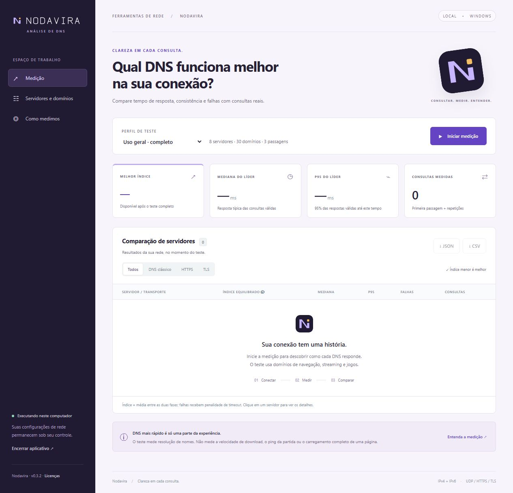

# Nodavira

**Português** · [English](README.en.md)


**Aplicativo open-source para Windows e Linux que compara resolvedores DNS com IPv4, IPv6, DNS over HTTPS e DNS over TLS.**

**[Baixar Nodavira.exe](https://github.com/saintluc4/nodavira/releases/download/v0.5.0/Nodavira.exe)** · [Versões e requisitos](https://github.com/saintluc4/nodavira/releases) · [Reportar um problema](https://github.com/saintluc4/nodavira/issues/new/choose)

Desenvolvi o Nodavira para comparar resolvedores DNS a partir da conexão em que eles serão utilizados. Meu objetivo é medir latência, variação e falhas com um conjunto de consultas conhecido, mantendo a metodologia e os resultados disponíveis para análise.

Adotei consultas diretas aos resolvedores, suporte a transportes criptografados e uma lista de domínios personalizável. O aplicativo executa localmente, abre em uma **janela própria** e não modifica a configuração DNS do sistema. Disponibilizo o código, a documentação e os recursos visuais neste repositório. As bibliotecas utilizadas estão identificadas nos avisos de terceiros.

**Versão do código: `0.5.0`, com interface em português e inglês para Windows e Linux.** O projeto está em desenvolvimento inicial. Trato o ranking como uma comparação exploratória das condições observadas durante o teste; ele não certifica a qualidade de um provedor nem prevê seu desempenho futuro.

Para **Ubuntu, Linux Mint e Arch**, documentei pacotes, requisitos e compilação no [guia Linux](docs/LINUX.md). O empacotamento Arch inclui um `PKGBUILD`; a publicação no AUR ainda está pendente.

| Sistema | Arquivo para instalar |
|---|---|
| Ubuntu 24.04+ / Mint 22+ | `nodavira_0.5.0-1_all.deb`, instalado com `apt install ./arquivo.deb` |
| Arch Linux | `nodavira-0.5.0-1-any.pkg.tar.zst`, instalado com `pacman -U ./arquivo.pkg.tar.zst` |

Os pacotes Linux são produzidos pelo [workflow Linux packages](https://github.com/saintluc4/nodavira/actions/workflows/linux.yml) para distribuição nas [Releases](https://github.com/saintluc4/nodavira/releases). Os requisitos do sistema são resolvidos pelo gerenciador de pacotes. A validação automatizada no Ubuntu é a referência para o Mint; ainda não houve teste manual no desktop do Mint.

## Interface



*Captura real da interface da versão 0.3.2, antes de iniciar uma medição. Os indicadores são preenchidos durante o teste. A mesma interface é utilizada na janela Windows e no modo navegador.*

## Usar, estudar ou contribuir

| Objetivo | Onde encontrar |
|---|---|
| Usar o aplicativo | Baixe `Nodavira.exe` na seção **Releases** e abra o arquivo |
| Ler e modificar o código | Explore `nodavira/`, `static/` e `app.py` neste repositório |
| Acessar logo e recursos editáveis | Veja [`brand/`](brand/), [`static/`](static/) e o [guia de identidade](BRAND.md) |
| Entender a medição | Leia a seção Metodologia abaixo e [`METHODOLOGY.md`](METHODOLOGY.md) |
| Compilar ou contribuir | Siga [`CONTRIBUTING.md`](CONTRIBUTING.md) |

Distribuo o executável nas Releases para uso imediato. Mantenho no repositório os arquivos necessários para estudar, modificar, testar e compilar o projeto.

## Identidade

Mantive o símbolo, o lettering vetorial e a paleta em arquivos editáveis. O mesmo ícone identifica a janela e o executável. Documentei os arquivos, a construção e a geração das versões SVG/ICO no [guia de identidade](BRAND.md).

## Recursos

| Recurso | Implementação |
|---|---|
| DNS tradicional | UDP com fallback para TCP quando a resposta é truncada |
| DNS over HTTPS — DoH | POST em formato DNS binário, HTTP/2 habilitado e HTTP/1.1 permitido |
| DNS over TLS — DoT | TLS com validação de certificado e hostname |
| IPv4 e IPv6 | IP de destino selecionado explicitamente, inclusive no DoH |
| Tipos de registro | A e AAAA, selecionáveis separadamente |
| Métricas | Mediana, P95, média, dispersão, falhas e índice com penalidades |
| Testes personalizados | Servidores, domínios, passagens, concorrência e timeout configuráveis |
| Importação | TXT ou hostnames extraídos localmente de um HAR |
| Exportação | JSON completo e CSV com uma linha por consulta |
| Interface | Português e inglês, janela Windows/WebView2 ou Linux/GTK e opção de execução no navegador |

## Idioma

Use o seletor **Idioma / Language** no topo da janela para alternar entre português e inglês sem reiniciar nem alterar a configuração da medição. A escolha fica salva em `%APPDATA%/nodavira/preferences.json` no Windows e em `$XDG_CONFIG_HOME/nodavira/preferences.json` no Linux (padrão: `~/.config/nodavira/preferences.json`). No primeiro uso, sistemas com idioma português usam português; os demais usam inglês.

Menus, metodologia, detalhes, progresso e mensagens de validação são traduzidos. Os identificadores técnicos do JSON/CSV, nomes personalizados, domínios e valores medidos permanecem estáveis. Textos de licenças e diagnósticos de bibliotecas externas mantêm o idioma original. A lista de domínios não muda com o idioma e inclui serviços brasileiros; personalize-a para representar sua rotina.

## Usar o executável

Para utilizar o aplicativo, baixe **[Nodavira.exe](https://github.com/saintluc4/nodavira/releases/download/v0.5.0/Nodavira.exe)**. O executável inclui o interpretador Python e as bibliotecas do projeto; não é necessário baixar o código-fonte ou instalar Python.

1. Salve `Nodavira.exe` em uma pasta com permissão de escrita.
2. Abra o arquivo com dois cliques.
3. Escolha **Uso geral · completo** e clique em **Iniciar medição**.
4. Aguarde a conclusão. Clique em uma linha para ver detalhes do servidor.
5. Exporte o resultado em JSON ou CSV. O JSON também é salvo automaticamente em `reports/`, ao lado do executável.
6. Use **Encerrar aplicativo** ou feche a janela. Um teste em andamento será interrompido e os resultados parciais serão preservados quando possível.

### Requisitos

- **Windows x64**. Validei a distribuição em Windows 10 x64; outras versões e arquiteturas não foram verificadas.
- **Microsoft Edge WebView2 Runtime** para a janela integrada. [Download oficial do WebView2](https://developer.microsoft.com/microsoft-edge/webview2/).
- **.NET Framework 4.6.2 ou superior**, utilizado pelo componente de janela.
- Conectividade com os resolvedores selecionados; IPv6 funcional para testes de transporte IPv6.

O executável inclui o interpretador Python e as bibliotecas do aplicativo, mas **não inclui o instalador do WebView2 nem do .NET Framework**. Não instala serviço do Windows e não exige privilégios de administrador para operar.

Se a janela integrada não estiver disponível, é possível abrir a mesma interface no navegador:

```powershell
.\Nodavira.exe --browser
```

O executável não possui assinatura digital de editor. Publico seu SHA-256 na descrição de cada Release. Para conferir a integridade do arquivo baixado, compare esse hash com o resultado do comando:

```powershell
Get-FileHash .\Nodavira.exe -Algorithm SHA256
```

## Arquitetura

Separei a aplicação em um motor Python de medição e uma interface HTML/CSS/JavaScript. Na distribuição Windows, a interface é exibida por **pywebview + WebView2**. A comunicação com o motor utiliza uma API HTTP autenticada em `127.0.0.1`, numa porta temporária. Os arquivos da interface são locais e não dependem de um site hospedado.

```text
Janela Windows / WebView2 ou Linux / GTK + WebKitGTK
           |
           | API local autenticada (loopback)
           v
Motor Python de benchmark
           |
           +---- UDP / TCP ----> resolvedor selecionado
           +---- HTTPS -------> resolvedor selecionado
           +---- TLS ---------> resolvedor selecionado
```

As ações de benchmark usam a API HTTP local. Não exponho objetos Python à página por meio de `js_api`. A API exige token e verifica a origem e o cabeçalho Host. Ao fechar a janela, o processo solicita o cancelamento da medição, aguarda as operações em andamento dentro dos limites previstos e encerra o servidor.

### Configuração padrão

| Parâmetro | Valor |
|---|---|
| Domínios | 30 nomes de navegação, serviços, streaming, jogos e conteúdo externo |
| Tipos de consulta | A e AAAA |
| Passagens | 3: primeira passagem e 2 repetições |
| Concorrência | Até 4 consultas simultâneas, para um servidor por vez |
| Timeout | 1.500 ms por consulta, incluindo conexão e eventual fallback |
| Seleção inicial | DNS do sistema e serviços públicos em IPv4, UDP e DoH |

DoT e IPv6 podem ser selecionados em **Servidores e domínios**. O catálogo inclui Cloudflare, Google e Quad9 e aceita servidores personalizados. A lista de nomes está em [`nodavira/config.py`](nodavira/config.py).

O volume planejado é `servidores × domínios × tipos × passagens`. Por exemplo, nove configurações, 30 nomes, dois tipos e três passagens produzem **1.620 consultas**, além das sondagens. Servidores indisponíveis na sondagem não entram nessa amostra.

**A/AAAA e IPv4/IPv6 são variáveis distintas:** o primeiro identifica o registro consultado; o segundo, o transporte até o resolvedor. Consultar AAAA por um resolvedor IPv4 não exige rota IPv6.

## Metodologia

Documentei abaixo as regras que determinam as amostras e o ranking. Os detalhes complementares estão em [`METHODOLOGY.md`](METHODOLOGY.md).

### 1. Sondagem e preparação

O programa registra parâmetros e semente aleatória. Cada faixa de concorrência consulta `example.com A` para verificar conectividade e abrir conexões. Se todas falharem, uma segunda tentativa usa `iana.org A`. Pelo menos uma resposta considerada válida mantém o servidor no teste.

As sondagens são registradas separadamente, fora do ranking. Servidores indisponíveis continuam visíveis. O bloqueio dos dois nomes pode excluir um servidor que funcionaria para outros domínios.

### 2. Consultas comparáveis

Todos os servidores disponíveis recebem os mesmos pares domínio/tipo. Em cada passagem, a ordem desses pares é embaralhada e dividida em blocos de até N consultas. Para cada bloco, a ordem dos servidores também é embaralhada.

Adotei um servidor por vez e uma pausa de 50 ms entre lotes para reduzir a competição provocada pelo próprio benchmark e parte do viés de ordem. Isso não elimina variações de rota, carga ou tráfego externo. A semente fica no JSON e permite reproduzir a ordem das consultas, mas não as condições da rede.

O tempo é medido com `time.perf_counter()`, desde a troca até a recepção e validação básica da resposta. Reconexões e fallback ocorridos nessa operação contam. A criação do objeto da consulta fica fora da medição.

### 3. Primeira passagem e repetições

Uso os termos primeira passagem e repetições porque **a primeira passagem não comprova cache vazio**. As consultas vão diretamente ao IP selecionado, mas o provedor pode já ter o nome em cache. Se o IP selecionado for um intermediário local, como `127.0.0.53` no Linux, a medição inclui esse serviço e seu possível cache. Serviços e transportes de um mesmo provedor também podem compartilhar cache.

As passagens seguintes repetem os mesmos nomes. O programa não infere um cache hit apenas pela latência e não controla a permanência dos registros no cache remoto. Não utilizo subdomínios aleatórios como substitutos de consultas positivas reais sem cache.

### 4. Índice equilibrado

Para combinar latência e falhas, defini um custo para cada amostra:

```text
custo de uma resposta válida = latência observada
custo de uma falha           = máximo(latência observada, timeout configurado)

índice = 0,5 × média dos custos da primeira passagem
       + 0,5 × média dos custos das repetições
```

Dentro dessa regra, um índice menor indica menor custo observado. A penalidade impede que uma recusa rápida seja classificada como uma resposta eficiente. Mantive o peso 50/50 entre as fases mesmo quando há mais repetições; esse peso é uma decisão do projeto, não uma estimativa da frequência de cache hits de cada usuário.

Exemplo: primeira passagem com custo médio de 40 ms e repetições com custo médio de 20 ms produzem índice de 30 ms. Em uma fase com duas respostas de 20 ms e uma falha penalizada em 1.500 ms, o custo médio é `(20 + 20 + 1500) / 3 ≈ 513,3 ms`.

### 5. Estatísticas e classificação

| Métrica ou resposta | Tratamento |
|---|---|
| Mediana, média, mínimo, máximo e dispersão | Calculados apenas sobre respostas válidas |
| P95 | Interpolação linear na posição `(n − 1) × 0,95` das latências válidas ordenadas |
| Falhas | Proporção de amostras medidas que não produziram resposta considerada válida |
| P95 do lote | Tempo para concluir consultas paralelas de um bloco; não é tempo de página |
| `NOERROR` com registro solicitado | Resposta válida |
| `NOERROR` sem registro solicitado | Rotulada `NODATA`; válida, sem comprovar endereço utilizável |
| `NXDOMAIN`, `SERVFAIL`, `REFUSED` e outros erros DNS | Falha de resolução para esse conjunto de nomes |
| Endereço `0.0.0.0` ou `::` | Rotulado `BLOCKED`; falha |
| Erro TLS/HTTP, timeout, resposta incompatível ou truncamento residual | Falha |

Não removo outliers, tentativas lentas ou falhas por meio de retentativas silenciosas. Como mediana e P95 excluem amostras inválidas, essas métricas devem ser analisadas junto com o percentual de falhas.

Nomes desativados e políticas de bloqueio podem produzir falhas. O percentual observado não equivale à disponibilidade universal do provedor. Também não são detectados todos os métodos de filtragem ou confirmados todos os IPs retornados.

Resultados em andamento são provisórios. Um teste interrompido não apresenta vencedor; configurações sem respostas válidas também não são apresentadas como líder.

### 6. Particularidades dos transportes

- **UDP:** EDNS com payload de 1.232 bytes; fallback TCP incluído na mesma amostra e no mesmo timeout.
- **DoH:** POST `application/dns-message`, ID zero, IP bootstrap fixado e hostname/SNI preservados. HTTP/2 habilitado, HTTP/1.1 permitido e versão negociada registrada. Sem redirects ou proxy automático do ambiente.
- **DoT:** enquadramento com prefixo de comprimento de dois bytes, TLS autenticado e porta 853 por padrão.
- **Conexões:** um cliente persistente por faixa de concorrência. Não há pipelining numa mesma conexão DoT; o conjunto de conexões DoH não reproduz exatamente o multiplexing de um navegador.
- **Erros:** encerramentos de conexão recebidos como erro contam como falhas. Aplicativos que repetem automaticamente uma operação podem apresentar comportamento diferente.
- **Reconexões:** `connection_new` registra criação explícita de cliente/stream, não todos os handshakes internos do pool HTTP.

Certificados e hostname são validados. O bit AD é registrado como declaração do resolvedor, sem validação DNSSEC independente. Veja [`METHODOLOGY.md`](METHODOLOGY.md) para discussão complementar.

## Personalizar com TXT ou HAR

A lista padrão é um ponto de partida. Incluí importação TXT e HAR para permitir que o conjunto de nomes seja adaptado ao uso real. No caso do HAR, a interface extrai localmente apenas os hostnames HTTP/HTTPS. Caminhos, cookies, cabeçalhos e conteúdo não são enviados ao motor.

A importação adapta os nomes consultados; não replica as dependências ou os tempos de carregamento de uma página. Limites: 300 domínios, 32 configurações de servidor, 2–10 passagens, concorrência de 1–8, timeout de 500–5.000 ms, 50.000 consultas por teste e arquivos de até 30 MB.

## Limitações e interpretação

O propósito do projeto é oferecer uma medição local, documentada e passível de inspeção. Considero os seguintes limites ao interpretar os resultados:

- O resultado depende de conexão, rota, horário, carga e nomes escolhidos. Repita em horários diferentes e evite downloads intensos durante o teste.
- Não calculo intervalos de confiança ou significância estatística. Diferenças pequenas e amostras curtas não sustentam uma escolha definitiva.
- Não mede velocidade de download, ping de partida, qualidade de streaming, seleção de CDN ou tempo de carregamento de páginas.
- Não implementa cache recursivo vazio controlado, DoQ, DoH/HTTP3 ou DNSSEC independente.
- Não detecta interceptação transparente de UDP, DNS64 ou políticas de ECS.
- Não uso os resultados como demonstração de superioridade científica sobre outros benchmarks.

## Privacidade e dados locais

Não incluí telemetria, conta online ou recursos de interface carregados de serviços externos. **As consultas DNS são enviadas aos resolvedores selecionados**, que recebem os nomes testados. DoH e DoT protegem o transporte, mas não ocultam as consultas do próprio provedor.

JSON e CSV podem conter nomes personalizados, IPs, respostas e parâmetros da rede. `reports/` e `session*.json` ficam fora do Git e do pacote de código-fonte. Não publique arquivos de sessão, pois contêm dados de acesso à API local.

## Executar pelo código-fonte

Utilizo Windows x64 e Python 3.13 como ambiente de referência. Na raiz do projeto:

```powershell
py -3.13 -m venv .venv
.\.venv\Scripts\python.exe -m pip install --target .deps -r requirements-lock.txt
.\.venv\Scripts\python.exe app.py
```

Não é necessário ativar scripts no PowerShell. Alternativas:

```powershell
# Interface no navegador; encerra após inatividade se não houver teste em execução
.\.venv\Scripts\python.exe app.py --browser

# Somente servidor; URL/token impressos no terminal; Ctrl+C para encerrar
.\.venv\Scripts\python.exe app.py --no-browser --port 8765
```

`--session-file caminho.json` grava a URL para automação local. Esse arquivo não deve ser publicado. No modo `--no-browser`, não há encerramento automático por inatividade.

## Compilar o `.exe`

Execute em Windows x64 com Python x64, após instalar as dependências acima:

```powershell
.\.venv\Scripts\python.exe -m pip install -r requirements-build.txt
.\.venv\Scripts\python.exe build.py
```

O PyInstaller empacota interpretador, motor, dependências da janela e interface. São gerados:

```text
dist/Nodavira.exe        # Aplicativo destinado ao usuário final
dist/SHA256.txt          # Hash para verificação da distribuição
```

Registro as versões das dependências nos arquivos de requisitos. Isso não garante um executável idêntico byte a byte entre ambientes diferentes. O processo de build não assina digitalmente o arquivo.

## Testes e validação

A versão 0.3.2 foi validada com **38 testes automatizados**. A verificação isolada do executável no Windows 10 x64 concluiu **48/48 consultas válidas** entre UDP, DoH e DoT sobre IPv4/IPv6, além dos controles de exportação, rejeição de certificado com hostname incorreto, cancelamento e encerramento.

```powershell
# Testes sem consultas a DNS públicos
.\.venv\Scripts\python.exe -m unittest discover -s tests -v

# Verificação dos transportes na rede real
.\.venv\Scripts\python.exe scripts/smoke_network.py

# Verificação da janela e do executável já compilado, usando rede real
.\.venv\Scripts\python.exe scripts/verify_package.py
```

Os testes de rede dependem das rotas e permissões locais. A verificação do pacote exige IPv6 funcional e inclui um controle TLS com hostname incorreto. Mantenho o registro de validação e suas condições em [`TESTING.md`](TESTING.md).

## Estrutura

```text
app.py                    # Inicialização e ciclo de vida
nodavira/config.py        # Catálogo e validação
nodavira/engine.py        # Protocolos, agendamento e estatísticas
nodavira/server.py        # API local, exportação e relatórios
nodavira/desktop.py       # Janela Windows/WebView2 ou Linux/GTK
nodavira/platforms.py     # Renderer e diretório de relatórios por sistema
static/                   # Interface em português e inglês
tests/                    # Testes automatizados
scripts/                  # Verificação, identidade e empacotamento
brand/                    # Símbolo, lettering e banner editáveis
docs/images/              # Capturas utilizadas na documentação
packaging/                # Metadados do executável
build.py                  # Build da distribuição
requirements-lock.txt     # Dependências de execução
requirements-build.txt    # Ferramentas de compilação
requirements-linux-lock.txt # Bibliotecas Python do pacote Debian
scripts/package_linux.py # Pacote Debian, fonte tar.gz e receita Arch
```

## Distribuição e contribuições

Publico o executável em [Releases](https://github.com/saintluc4/nodavira/releases), acompanhado de versão, requisitos, validação e SHA-256. O código e os recursos ficam navegáveis no repositório, separados do binário de distribuição.

Para gerar uma cópia dos arquivos públicos:

```powershell
.\.venv\Scripts\python.exe scripts/package_release.py --source
```

O comando produz `Nodavira-Source.zip` usando uma lista explícita de arquivos e diretórios. Dependências locais, ambientes virtuais, builds, executáveis, relatórios e sessões não entram nesse pacote.

Aceito relatos de problemas, propostas de melhoria e pull requests. As orientações de ambiente, testes e contribuição estão em [`CONTRIBUTING.md`](CONTRIBUTING.md).

## Licença

Disponibilizo o código, a documentação e os recursos visuais próprios sob a [licença MIT](LICENSE).

As dependências mantêm suas próprias licenças, identificadas em [`THIRD_PARTY_NOTICES.md`](THIRD_PARTY_NOTICES.md) e [`licenses/`](licenses/). A licença do projeto e esses avisos também estão incorporados ao executável e podem ser lidos no botão **Licenças** da interface, sem arquivos externos.

## Referências técnicas

- [RFC 8484 — DNS over HTTPS](https://www.rfc-editor.org/rfc/rfc8484)
- [RFC 7858 — DNS over TLS](https://www.rfc-editor.org/rfc/rfc7858)
- [RFC 7766 — DNS sobre TCP](https://www.rfc-editor.org/rfc/rfc7766)
- [Cloudflare — configuração](https://developers.cloudflare.com/1.1.1.1/setup/)
- [Google — transportes seguros](https://developers.google.com/speed/public-dns/docs/secure-transports)
- [Quad9 — serviços](https://docs.quad9.net/services/)
- [pywebview — API](https://pywebview.flowrl.com/api/)
- [pywebview — empacotamento](https://pywebview.flowrl.com/guide/freezing)
